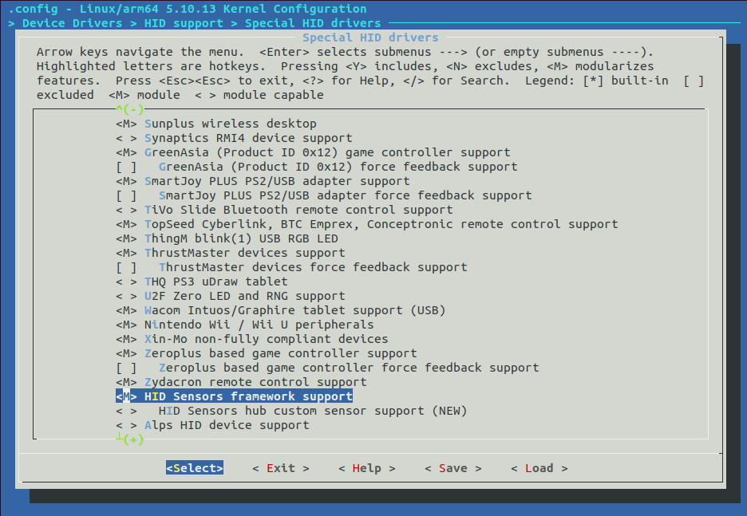
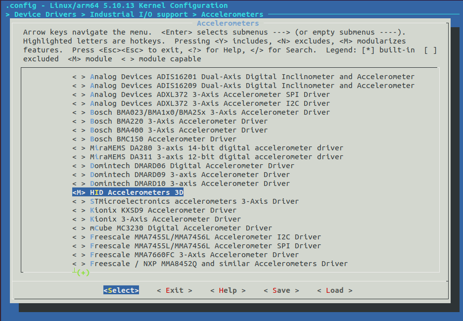
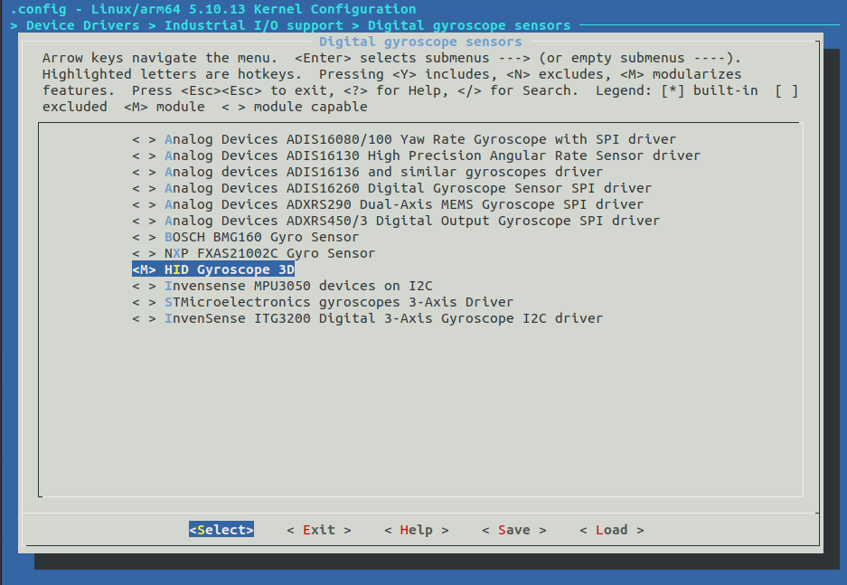

# Raspberry Pi OS 64bit Installation
This is a setup guide for Realsense with Raspberry Pi OS 64bit.  
These steps are for L515 (maybe D4XX) with Raspberry Pi 64bit.

## Preparation
- Host PC (Ubuntu 18.04 or Higher)
- Raspberry Pi 4 (maybe 3+)

## Install Raspberry Pi OS 64 bit (Bata test version)
Write Raspberry Pi OS 64bit to SD card.  
Latest builds of the 64 bit image can be found.  
https://downloads.raspberrypi.org/raspios_arm64/images/  
  
Note: (2021.2.6) Install "raspios_arm64-2020-08-24".  

### Update the software (On Raspberry Pi):
```
# On Raspberry Pi
$ sudo apt update
$ sudo apt upgrade
```

## Patch kernel and Cross-compile (On host PC)
Build and apply patched kernel modules.  
Build the kernel on the host PC (Cross-compiling).  
See the Raspberry Pi documentation for more information on building.
- [Kernel building](https://www.raspberrypi.org/documentation/linux/kernel/building.md)

Note: (2021.2.6) For 64bit, Only cross-compilation is possible.  
  
### Install dependencies:
```
# On host PC
$ sudo apt install git bc bison flex libssl-dev make
$ sudo apt install git bc bison flex libssl-dev make libc6-dev libncurses5-dev

# For 64-bit toolchain for a 64-bit kernel.
$ sudo apt install crossbuild-essential-arm64
```
  
### Get kernel source:
```
# On host PC
$ git clone --depth=1 https://github.com/raspberrypi/linux

# 2021.2.6 commit 431ac1d21b5e842c5a564bc0bab31d7dc11611f5
```
  
### Patch kernel source:  
Apply the following patch of [librealsense](https://github.com/IntelRealSense/librealsense).
- [realsense-camera-formats-focal-master.patch](https://github.com/IntelRealSense/librealsense/blob/c7fbb7af032162f250c39322a86de9379df0bfd9/scripts/realsense-camera-formats-focal-master.patch)
- [realsense-hid-focal-master.patch](https://github.com/IntelRealSense/librealsense/blob/c7fbb7af032162f250c39322a86de9379df0bfd9/scripts/realsense-hid-focal-master.patch)
- [realsense-metadata-focal-master.patch](https://github.com/IntelRealSense/librealsense/blob/c7fbb7af032162f250c39322a86de9379df0bfd9/scripts/realsense-metadata-focal-master.patch)
- [realsense-powerlinefrequency-control-fix.patch](https://github.com/IntelRealSense/librealsense/blob/c7fbb7af032162f250c39322a86de9379df0bfd9/scripts/realsense-powerlinefrequency-control-fix.patch)

However, these patch cannot be applied to the kernel source of Raspberry Pi.  
For this reason, I have prepared patches for Raspberry Pi kernels.
- [raspberry_pi_kernel_64.patch](../script/raspberry_pi_kernel_5.10.13.patch.patch)

```
# On host PC
$ git clone https://github.com/NobuoTsukamoto/realsense_examples.git

# move kernel source dir and patch.
$ cd linux
$ patch -p1 < ../NobuoTsukamoto/script/raspberry_pi_kernel_5.10.13.patch 
```

### Apply the default configuration and change configuration:
```
# On host PC
# For Raspberry Pi 4 default build configuration
$ KERNEL=kernel8
$ make ARCH=arm64 CROSS_COMPILE=aarch64-linux-gnu- bcm2711_defconfig
$ make ARCH=arm64 CROSS_COMPILE=aarch64-linux-gnu- menuconfig
```
Enable the following drivers:
- Deivce Drivers > HID support > Special HID drivers > HID Sensor framework support
  
- Deivce Drivers > Industrial I/O support > Accelerometers > HID Accelerometers
  
- Deivce Drivers > Industrial I/O support > Digital gyroscope sensors > HID Gyroscope 3D
  

### Build
```
# On host PC
$ make ARCH=arm64 CROSS_COMPILE=aarch64-linux-gnu- -j$(nproc) Image modules dtbs
```

### Install directly onto the SD card
Plug the SD card to the host PC.  
Install the kernel modules, kernel and Device Tree blobs onto the SD card.  
- _PATH_TO_ROOTFS_: mounting rootfs (EXT4) partition.
- _PATH_TO_BOOT_: mounting boot (FAT32) partision.

```
$ sudo env PATH=$PATH make ARCH=arm64 CROSS_COMPILE=aarch64-linux-gnu- INSTALL_MOD_PATH=PATH_TO_ROOTFS modules_install
$ sudo cp arch/arm64/boot/Image PATH_TO_BOOT/$KERNEL.img
$ sudo cp arch/arm64/boot/dts/broadcom/*.dtb PATH_TO_BOOT
$ sudo cp arch/arm64/boot/dts/overlays/*.dtb* PATH_TO_BOOT/overlays/
$ sudo cp arch/arm64/boot/dts/overlays/*.dtb* PATH_TO_BOOT/overlays/
$ sudo cp arch/arm64/boot/dts/overlays/README PATH_TO_BOOT/overlays/
```

## Boot Raspberry Pi and Build librealsense (On Raspberry Pi)
Make sure the Raspberry Pi boots on the SD card with the kernel installed.
```
$ uname -a
Linux raspberrypi 5.10.13-v8+ #1 SMP PREEMPT Fri Feb 5 21:19:47 JST 2021 aarch64 GNU/Linux
```

### Install dependencies:

```
$ sudo apt -y install git libssl-dev libusb-1.0-0-dev pkg-config libgtk-3-dev
$ sudo apt -y install libglfw3-dev libgl1-mesa-dev libglu1-mesa-dev at
$ sudo apt -y install python3-pybind11
$ sudo apt -y install pybind11-dev
$ sudo apt -y install cmake
```
Note: libapriltag-dev will not be installed. This is because an error will occur in the build.

### Download source and build.
Build with the latest release (Get it from the repository if necessary).  
```
$ wget https://github.com/IntelRealSense/librealsense/archive/v2.41.0.tar.gz
$ tar xf v2.41.0.tar.gz
$ cd librealsense-2.41.0
```  
update udev rule.
```
$ sudo ./scripts/setup_udev_rules.sh
```
configuration and build.  
Note:  
- **FORCE_RSUSB_BACKEND is OFF** because patched the kernel source.
- BUILD_PYTHON_BINDINGS, BUILD_WITH_OPENMP can be specified as you like.
- You can reduce the build time by specifying the -j option.

```
$ mkdir build && cd build
$ cmake .. \
    -DBUILD_PYTHON_BINDINGS=ON \
    -DBUILD_WITH_OPENMP=ON \
    -DCMAKE_BUILD_TYPE=Release
$ make -j3
$ sudo make install
```

Finally, need to reboot pi
```
$ sudo reboot
```

## Try RealSense (On Raspberry Pi)
Connect RealSense (L515) and launch realsense-viewer.
```
$ realsense-viewer
```

- [x] RealSense device is displayed
- [x] The Motion Module is valid.  
      When turned on, Accel stream and Gyro stream are displayed.
- [x] Depth Sensor is enabled.  
      When turned on, the Depth stream should be displayed.